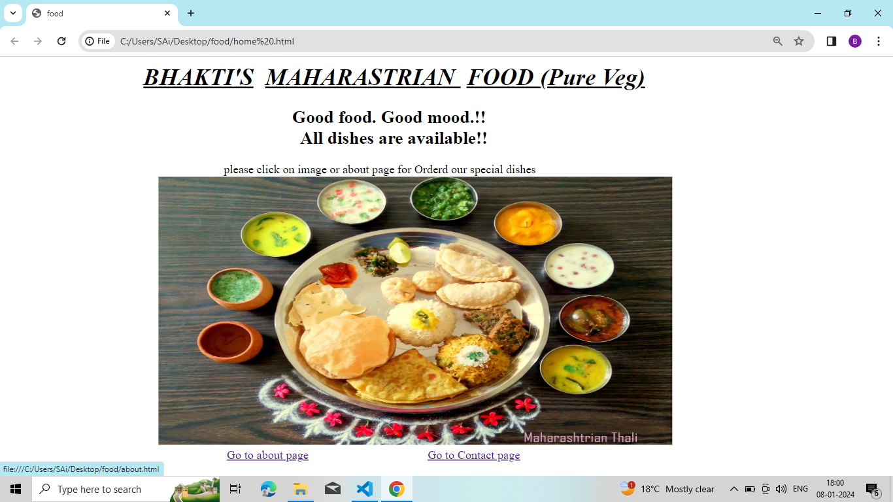
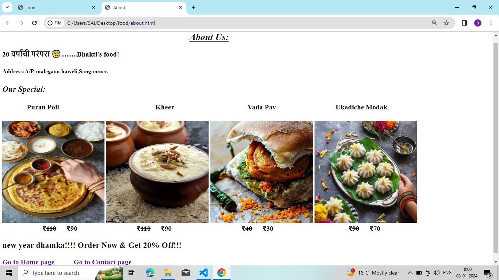

# **Bhakti's Maharastrian Food**
---
Welcome to Bhakti's Maharastrian Food.In our restaurant many maharatrian dishes are available.

## Characteristics
There are three types of users for our system
### 1. Customer Class
- Customers interact with our system directly in order to place order, modify order, get bill and give feedback. 
- We do not store any information related to customers in our system. 
### 2. Head Chef/Kitchen Manager
- Head Chef can mark a dish as prepared when a chef tells him to do so. 
-  Head chef can also assign a dish to a particular chef based on the specialty of the chef.

### 3. Chef
- Chefs don’t interact with the system.
- They just have to look at the dishes present in their queues and prepare the dishes accordingly. 

## Features
1. Quality assurance
2. Exclusive offers
3. Affordable Pricing
4. Good Experienced Chef

### Home Page

### Special dishes

